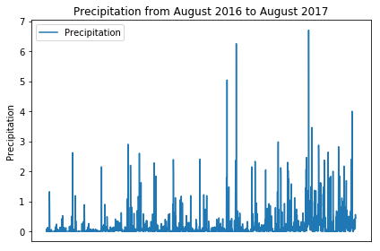
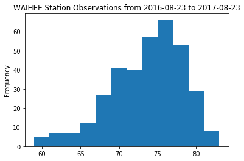
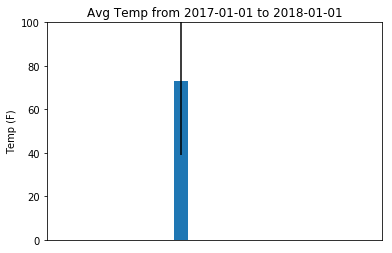

## Step 3 - Climate Analysis and Exploration

-- You are now ready to use Python and SQLAlchemy to do basic climate analysis and data exploration on your new weather station tables. All of the following analysis should be completed using SQLAlchemy ORM queries, Pandas, and Matplotlib.

-- Create a Jupyter Notebook file called `climate_analysis.ipynb` and use it to complete your climate analysis and data exploration.

-- Choose a start date and end date for your trip. Make sure that your vacation range is approximately 3-15 days total.

-- Use SQLAlchemy `create_engine` to connect to your sqlite database.

-- Use SQLAlchemy `automap_base()` to reflect your tables into classes and save a reference to those classes called `Station` and `Measurement`.


```python
# import dependencies
import matplotlib.pyplot as plt
from matplotlib import axes
import pandas as pd
import datetime as dt
import numpy as np
import matplotlib.dates as mdates
import matplotlib.cbook as cbook

# Python SQL toolkit and Object Relational Mapper
import sqlalchemy
from sqlalchemy.ext.automap import automap_base
from sqlalchemy.orm import Session
from sqlalchemy import create_engine, inspect, func, Column, Integer, String, Float, Date
from sqlalchemy.ext.declarative import declarative_base
```


```python
# Use SQLAlchemy create_engine to connect to your sqlite database.
engine = create_engine("sqlite:///Homework/Instructions/Resources/hawaii.sqlite")

```


```python
# Use SQLAlchemy automap_base() to reflect your tables into classes
Base = automap_base()
```


```python
# save a reference to those classes called Station and Measurement
Base.prepare(engine, reflect=True)
Base.classes.keys()

Measurements = Base.classes.Measurement
Stations = Base.classes.Station
```


```python
# Create a session
session = Session(engine)
```

### Precipitation Analysis

-- Design a query to retrieve the last 12 months of precipitation data. (data is from 01/01/2010 - 08/23/2017) 

-- Select only the `date` and `prcp` values.

-- Load the query results into a Pandas DataFrame and set the index to the date column.

-- Plot the results using the DataFrame `plot` method.

-- Use Pandas to print the summary statistics for the precipitation data.


```python
# Get a list of column names and types
inspector = inspect(engine)
inspector.get_table_names()

columns = inspector.get_columns('Measurement')
for c in columns:
    print(c['name'], c["type"])
```

    id INTEGER
    station VARCHAR(255)
    date VARCHAR(255)
    prcp INTEGER
    tobs INTEGER


```python
# Design a query to retrieve the last 12 months of precipitation data.
sel = [Measurements.date, 
       Measurements.prcp]
precip_analysis= session.query(*sel).\
    filter(Measurements.date.between('2016-08-23','2017-08-23')).all()
```


```python
# Load the query results into a Pandas DataFrame and set the index to the date column.

precip_df = pd.DataFrame(precip_analysis, columns=['Date','Precipitation'])
precip_df.set_index(precip_df['Date'], inplace=True)
precip_df.drop(precip_df.Date)
precip_df.head()
```


<div>
<style scoped>
    .dataframe tbody tr th:only-of-type {
        vertical-align: middle;
    }

    .dataframe tbody tr th {
        vertical-align: top;
    }

    .dataframe thead th {
        text-align: right;
    }
</style>
<table border="1" class="dataframe">
  <thead>
    <tr style="text-align: right;">
      <th></th>
      <th>Date</th>
      <th>Precipitation</th>
    </tr>
    <tr>
      <th>Date</th>
      <th></th>
      <th></th>
    </tr>
  </thead>
  <tbody>
    <tr>
      <th>2016-08-23</th>
      <td>2016-08-23</td>
      <td>0.00</td>
    </tr>
    <tr>
      <th>2016-08-24</th>
      <td>2016-08-24</td>
      <td>0.08</td>
    </tr>
    <tr>
      <th>2016-08-25</th>
      <td>2016-08-25</td>
      <td>0.08</td>
    </tr>
    <tr>
      <th>2016-08-26</th>
      <td>2016-08-26</td>
      <td>0.00</td>
    </tr>
    <tr>
      <th>2016-08-27</th>
      <td>2016-08-27</td>
      <td>0.00</td>
    </tr>
  </tbody>
</table>
</div>


```python
# Plot the results using the DataFrame plot method.
#precip_df.plot(x=precip_df.Date, y=precip_df.Precipitation, kind="scatter")
precip_df.plot(x_compat=True)
plt.title("Precipitation from August 2016 to August 2017")
plt.ylabel("Precipitation")
plt.xlabel("")
plt.xticks([])
plt.tight_layout()
plt.show()
```





```python
# Use Pandas to print the summary statistics for the precipitation data.
print(f"Summary Statistics")
print(f"---------------")
print(f"Max Precipitation: {precip_df.Precipitation.max()}")
print(f"Min Precipitation: {precip_df.Precipitation.min()}")
print(f"Average Precipitation: {precip_df.Precipitation.mean()}")
```

    Summary Statistics
    ---------------
    Max Precipitation: 6.7
    Min Precipitation: 0.0
    Average Precipitation: 0.17727857496288996


### Station Analysis

-- Design a query to calculate the total number of stations.

-- Design a query to find the most active stations.

-- List the stations and observation counts in descending order

  -- Which station has the highest number of observations?

-- Design a query to retrieve the last 12 months of temperature observation data (tobs).

-- Filter by the station with the highest number of observations.

-- Plot the results as a histogram with `bins=12`.


```python
# Get a list of column names and types
inspector = inspect(engine)
inspector.get_table_names()

columns = inspector.get_columns('Station')
for c in columns:
    print(c['name'], c["type"])
```

    id INTEGER
    station VARCHAR(255)
    name VARCHAR(255)
    latitude INTEGER
    longitude INTEGER
    elevation INTEGER


```python
# Design a query to calculate the total number of stations.
# Design a query to find the most active stations.
# List the stations and observation counts in descending order
sel = [Stations.name, Measurements.station]
station_counts = session.query(*sel, func.count(Measurements.station)).\
    filter(Measurements.station == Stations.station).\
    group_by(Stations.name).\
    order_by(func.count(Measurements.station).desc()).all()
    
    
station_counts
```


    [('WAIHEE 837.5, HI US', 'USC00519281', 2772),
     ('KANEOHE 838.1, HI US', 'USC00513117', 2696),
     ('WAIKIKI 717.2, HI US', 'USC00519397', 2685),
     ('WAIMANALO EXPERIMENTAL FARM, HI US', 'USC00519523', 2572),
     ('MANOA LYON ARBO 785.2, HI US', 'USC00516128', 2484),
     ('KUALOA RANCH HEADQUARTERS 886.9, HI US', 'USC00514830', 1937),
     ('HONOLULU OBSERVATORY 702.2, HI US', 'USC00511918', 1932),
     ('PEARL CITY, HI US', 'USC00517948', 683),
     ('UPPER WAHIAWA 874.3, HI US', 'USC00518838', 342)]


```python
# Which station has the highest number of observations?
print(f"The most active station is: {station_counts[0]}. ")
```

    The most active station is: ('WAIHEE 837.5, HI US', 'USC00519281', 2772). 


```python
# Design a query to retrieve the last 12 months of temperature observation data (tobs).
# Filter by the station with the highest number of observations.
sel = [Measurements.date, Measurements.tobs, Measurements.station, Stations.name]
       
station_tobs = session.query(*sel).\
    filter(Measurements.station == Stations.station).\
    filter(Measurements.date.between('2016-08-23','2017-08-23')).\
    filter(Measurements.station == "USC00519281").all()


station_tobs_df = pd.DataFrame(station_tobs, columns=['Date','Temp','Station', 'Name'])
station_tobs_df.set_index(station_tobs_df['Date'], inplace=True)
station_tobs_df.head()

```


<div>
<style scoped>
    .dataframe tbody tr th:only-of-type {
        vertical-align: middle;
    }

    .dataframe tbody tr th {
        vertical-align: top;
    }

    .dataframe thead th {
        text-align: right;
    }
</style>
<table border="1" class="dataframe">
  <thead>
    <tr style="text-align: right;">
      <th></th>
      <th>Date</th>
      <th>Temp</th>
      <th>Station</th>
      <th>Name</th>
    </tr>
    <tr>
      <th>Date</th>
      <th></th>
      <th></th>
      <th></th>
      <th></th>
    </tr>
  </thead>
  <tbody>
    <tr>
      <th>2016-08-23</th>
      <td>2016-08-23</td>
      <td>77</td>
      <td>USC00519281</td>
      <td>WAIHEE 837.5, HI US</td>
    </tr>
    <tr>
      <th>2016-08-24</th>
      <td>2016-08-24</td>
      <td>77</td>
      <td>USC00519281</td>
      <td>WAIHEE 837.5, HI US</td>
    </tr>
    <tr>
      <th>2016-08-25</th>
      <td>2016-08-25</td>
      <td>80</td>
      <td>USC00519281</td>
      <td>WAIHEE 837.5, HI US</td>
    </tr>
    <tr>
      <th>2016-08-26</th>
      <td>2016-08-26</td>
      <td>80</td>
      <td>USC00519281</td>
      <td>WAIHEE 837.5, HI US</td>
    </tr>
    <tr>
      <th>2016-08-27</th>
      <td>2016-08-27</td>
      <td>75</td>
      <td>USC00519281</td>
      <td>WAIHEE 837.5, HI US</td>
    </tr>
  </tbody>
</table>
</div>


```python
# Plot the results as a histogram with bins=12.
plt.hist(station_tobs_df.Temp, bins=12)
plt.ylabel("Frequency")
plt.title(f"WAIHEE Station Observations from {station_tobs_df.Date.min()} to 2017-08-23")
None
plt.show()
```





### Temperature Analysis

-- Write a function called `calc_temps` that will accept a start date and end date in the format `%Y-%m-%d` and return the minimum, average, and maximum temperatures for that range of dates.

-- Use the `calc_temps` function to calculate the min, avg, and max temperatures for your trip using the matching dates from the previous year (i.e. use "2017-01-01" if your trip start date was "2018-01-01")

-- Plot the min, avg, and max temperature from your previous query as a bar chart.

-- Use the average temperature as the bar height.

-- Use the peak-to-peak (tmax-tmin) value as the y error bar (yerr).


```python
# Use the calc_temps function to calculate the min, avg, and max temperatures for your trip using the matching dates from the previous year 
# (i.e. use "2017-01-01" if your trip start date was "2018-01-01")

start_date = "2017-01-01"
end_date = "2018-01-01"

calc_temps = session.query(func.min(Measurements.tobs), func.avg(Measurements.tobs), func.max(Measurements.tobs)).all()

print(f"The minimum, average, and maximum temps from {start_date} to {end_date} are: {calc_temps}.")
```

    The minimum, average, and maximum temps from 2017-01-01 to 2018-01-01 are: [(53, 72.99486272993427, 87)].


```python
calc_temps_df = pd.DataFrame(calc_temps, columns=['Min_Temp','Avg_Temp','Max_Temp'])
calc_temps_df
```


<div>
<style scoped>
    .dataframe tbody tr th:only-of-type {
        vertical-align: middle;
    }

    .dataframe tbody tr th {
        vertical-align: top;
    }

    .dataframe thead th {
        text-align: right;
    }
</style>
<table border="1" class="dataframe">
  <thead>
    <tr style="text-align: right;">
      <th></th>
      <th>Min_Temp</th>
      <th>Avg_Temp</th>
      <th>Max_Temp</th>
    </tr>
  </thead>
  <tbody>
    <tr>
      <th>0</th>
      <td>53</td>
      <td>72.994863</td>
      <td>87</td>
    </tr>
  </tbody>
</table>
</div>


```python
# Plot the min, avg, and max temperature from your previous query as a bar chart.
# Use the average temperature as the bar height.
max_min = calc_temps_df.Max_Temp - calc_temps_df.Min_Temp
plt.bar(calc_temps_df.Avg_Temp, calc_temps_df.Avg_Temp, yerr=max_min)
plt.ylabel("Temp (F)")
plt.title(f"Avg Temp from {start_date} to {end_date}")
plt.axis([65,85,0,100])
plt.xticks([])
None
plt.show()
```




